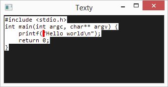

Texty
=====

A text editor born from the frustrations of inconsistensies of Vim.

## Todo list:

- [x] Create window
- [x] Writing text to the window
- [x] Backspace and newline
- [x] Simple cursor
- [x] Handle translating keys (shift)
- [x] File loading
- [ ] File saving

